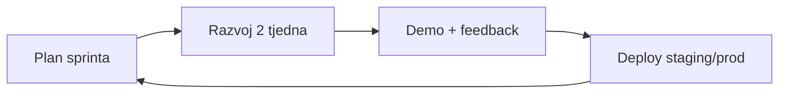

# dnevnik.live — Ponuda razvoja za tvrtku
**Trajanje:** 6 mjeseci · **Budžet:** 18.000 EUR (bez PDV-a, osim ako nije drugačije dogovoreno)  
**Model:** fiksni paket · intelektualno vlasništvo · programiranje · vođenje · održavanje

---

## 1. Sažetak ponude

Razvoj **dnevnik.live** kao komercijalne B2B/B2C platforme za vođenje uzgoja CBD biljaka, s postojećim MVP-om kao polaznom točkom. U 18.000 EUR uključeno je:

| Komponenta | Opis |
|------------|------|
| **Intelektualno vlasništvo** | Prijenos/autorskih prava na custom kod i dizajn razvijen u okviru projekta (isključujući open-source biblioteke, Firebase, vanjske API-je) |
| **Programiranje** | Frontend, Firebase integracija, admin, integracije senzora, Web3 pilot |
| **Vođenje projekta** | Planiranje, sprintovi, demo, dokumentacija, komunikacija s naručiteljem |
| **Servisi** | Postavljanje produkcije (GitHub Pages, Firebase, domena), CI, monitoring osnovni |
| **Održavanje** | 3 mjeseca uključena u paket (mj. 4–6), bugfix i manje nadogradnje |

**Cilj do kraja 6. mjeseca:** aplikacija spremna za **komercijalno korištenje** (stabilan produkcijski rad, sigurnost, onboarding, pravni minimum) + **Web3 pilot** (plant passport / wallet povezivanje, ne puna RWA burza).

---

## 2. Što je već napravljeno (polazno stanje — ~40–45 % komercijalnog MVP-a)

Ovo je već u repozitoriju i na **dnevnik.live** (procjena na temelju implementiranog koda):

### Korisnička aplikacija
- Prijava (Firebase Auth), sync podataka (Firestore `users/{uid}/app/state`)
- **Biljke i dnevnik:** CRUD biljaka, faze, podfaze (lonci / polje), lokacije polja, growlog
- **Dnevnik:** bilješke (zalijevanje, gnojidba, faza, stresori, presadjivanje), fotografije
- **Alati:** zalijevanje, gnojidba, okoliš, presadjivanje, stresori, grafovi
- **Nadzorna ploča**, dnevni zadaci (Danas), CPVO obrazac (embed)
- Widget **vremena** na pregledu biljaka
- **Pitch deck** (superadmin, investitori)

### Admin i uloge
- Uloge: `user`, `viewer`, `admin`, `superadmin`
- **Hybrid pristup** (npr. Filip, Marko): vlastita baza + dijeljena superadmin baza (read-only)
- Admin panel: korisnici, biljke, dnevnik (Firestore kolekcije)
- **Dijeljenje biljaka** superadmin → odabrani korisnici
- **Izvještaj prijava** (dnevno / 7 dana)
- Admin read-only pregled cijele baze

### Infrastruktura
- Deploy GitHub Pages, domena dnevnik.live
- Firestore **security rules** pripremljene (`firestore.rules`) — potrebno objaviti u produkciji
- Sync senzora vlažnosti tla (HTTP JSON + cache) — alat u **Alatima**

### Još nije komercijalno spremno
- Produkcijska sigurnost Firestore (deploy + test)
- GDPR, uvjeti korištenja, politika privatnosti
- Reset lozinke, verifikacija e-maila, onboarding
- Naplata / pretplata (ako je SaaS model)
- AI Coach (spomenut u pitch decku — nije implementiran)
- Pun Web3 (wallet, on-chain plant passport, RWA)
- Automatizirani testovi, SLA monitoring
- Mobilna aplikacija (native) — nije u opsegu; responsive web da

---

## 3. Ciljevi do komercijalnog lansmana

| Prioritet | Kriterij “spremno za komerciju” |
|-----------|--------------------------------|
| P0 | Firebase pravila aktivna, backup, stabilan auth |
| P0 | Pravni dokumenti + cookie suglasnost |
| P0 | Onboarding, dokumentacija za korisnika |
| P1 | Monitoring grešaka, performanse, QA mobil/desktop |
| P1 | Admin: stabilno upravljanje korisnicima i rolama |
| P1 | Export podataka (CSV/JSON) za korisnika |
| P2 | Integracija senzora (vlažnost + API za meteo) proširena |
| P2 | AI Coach MVP (preporuke na temelju dnevnika, bez “medicinskih” tvrdnji) |
| P3 | Web3 pilot (vidi odjeljak 5) |

---

## 4. Web3 i napredni servisi — što je realno u 18k

**Uključeno u 6 mjeseci (pilot):**
- Povezivanje **crypto walleta** (npr. MetaMask) s korisničkim računom
- **Plant Passport** kao digitalni zapis biljke (metadata off-chain + hash/anchor on-chain ili NFT mint na testnet/mainnet prema dogovoru)
- Javni **growlog view** po linku / QR (read-only)
- Dokumentacija arhitekture za budući **RWA** (tokenizacija, adopt-a-plant) — bez pune implementacije trgovanja

**Nije uključeno u 18k (faza 2 / zasebni projekt):**
- Regulirani RWA marketplace, custody, KYC/AML platforma
- Smart contract audit (zasebni budžet, preporuka 3–8k EUR)
- Vlastiti blockchain / token ekonomija
- Integracija plaćanja u kriptu za fizičke proizvode (CBD flower redeem)

---

## 5. Razvojni proces (kako radimo)

| Aktivnost | Učestalost |
|-----------|------------|
| Sprint planiranje | 1× tjedno (kratki sync) |
| Demo / pregled | 1× mjesečno (ili po milestoneu) |
| Deploy | Kontinuirano na `main` → dnevnik.live |
| Dokumentacija | Ažuriranje roadmapa + release notes |
| Održavanje | Mj. 4–6: bugfix do 8h/mj uključeno u paket |

**Komunikacija:** e-mail + jedan kanal (Slack/Teams/WhatsApp) po dogovoru.  
**Isporuke:** Git repozitorij, Firebase konzola (pristup tvrtki), pisani izvještaj na kraju svakog mjeseca.

---

## 6. Roadmap po mjesecima (6 × ~3.000 EUR)

### Mjesec 1 — Stabilizacija i produkcija (3.000 EUR)
**Fokus:** Sigurnost, stabilnost, komercijalni temelj.

| Napravljeno (plan) | Status danas |
|--------------------|------------|
| Deploy Firestore rules + test uloga | Pravila spremna, deploy obavezan |
| Bugfix auth, uloge, hybrid korisnici | Djelomično gotovo |
| QA glavnih flowova (biljke, dnevnik, sync) | Potrebno |
| Error logging (npr. Sentry) | Nije |
| Backup strategija Firestore | Nije |
| Tehnička dokumentacija arhitekture | Djelomično |

**Isporuka:** Produkcija stabilna; dokument “Stanje sustava v1”.

---

### Mjesec 2 — Komercijalni UX i pravni okvir (3.000 EUR)
**Fokus:** Spremno za prve platne / registrirane korisnike.

| Zadaci |
|--------|
| Onboarding (prvi login, prazna baza, tutorial) |
| Reset lozinke, e-mail verifikacija (Firebase) |
| Stranice: Uvjeti korištenja, Privatnost, Kontakt (HR) |
| Cookie banner + GDPR checklist |
| Poboljšanja UI/UX (mobilni, pristupačnost osnovna) |
| Export dnevnika/biljaka (CSV) |

**Isporuka:** “Komercijalni paket v0.9” — korisnik može legalno i sigurno koristiti app.

---

### Mjesec 3 — Admin, senzori, multi-korisnik (3.000 EUR)
**Fokus:** Operativa tvrtke i IoT.

| Zadaci |
|--------|
| Admin panel: stabilno upravljanje korisnicima, ulogama, dijeljenjem |
| Izvještaji (proširenje login reporta, aktivnost po biljkama) |
| Senzori: vlažnost tla + dokumentacija API-ja; CORS/HTTPS na serveru senzora |
| Opcionalno: 1 dodatni senzor ili meteo feed u timeline |
| Priprema **tenant** modela (ako više farmi / brendova) — dizajn, ne puna implementacija ako ne stane |

**Isporuka:** Operativni admin v1; senzori pouzdani u Alatima.

---

### Mjesec 4 — AI Coach MVP + priprema Web3 (3.000 EUR)
**Fokus:** Diferencijacija proizvoda (AI) i temelj Web3.

| Zadaci |
|--------|
| AI Coach MVP: preporuke na temelju faze, dnevnika, okoliša (OpenAI API ili slično — trošak API-a na tvrtku) |
| UI: “AI savjet” u growlogu / biljkama, disclaimer |
| Web3 dizajn: plant passport data model, wallet connect POC |
| Testnet deploy smart contracta (jednostavan) ili third-party (npr. NFT.Storage) |

**Isporuka:** AI Coach beta; Web3 arhitektura + POC wallet connect.

---

### Mjesec 5 — Web3 pilot (Plant Passport) (3.000 EUR)
**Fokus:** Implementacija pilot Web3 funkcija.

| Zadaci |
|--------|
| Wallet connect (MetaMask / WalletConnect) |
| Mint ili zapis **Plant Passport** ID-a uz biljku |
| Javni pregled biljke (passport link) — read-only |
| Integracija s growlogom (hash povijesti / snapshot) |
| Sigurnosni pregled (osnovni, ne pun audit) |

**Isporuka:** Web3 pilot na testnetu ili odabranoj mreži (dogovor); korisnički flow “Poveži wallet”.

---

### Mjesec 6 — Lansman, dokumentacija, održavanje (3.000 EUR)
**Fokus:** Go-live i predaja.

| Zadaci |
|--------|
| End-to-end QA, performance, bugfix |
| Korisnička dokumentacija (HR): kako koristiti app, admin vodič |
| Predaja: repo, Firebase, domena, `.env` predlošci |
| **Održavanje:** 3 mjeseca uključeno — ovaj mjesec + retrospektiva |
| Roadmap faza 2 (RWA, adopt-a-plant, mobilna app) |

**Isporuka:** Komercijalni release v1.0 + plan održavanja 12 mj. (opcija produženja).

---

## 7. Raspodjela budžeta (18.000 EUR)

| Stavka | EUR | % |
|--------|-----|---|
| Programiranje (6 × ~1.400) | 8.400 | 47 % |
| Projektni vođenje i analiza | 2.400 | 13 % |
| Intelektualno vlasništvo (prijenos IP) | 2.000 | 11 % |
| Održavanje (3 mjeseca, ~400/mj) | 1.200 | 7 % |
| Servisi i infrastruktura (setup, CI, alati) | 1.000 | 6 % |
| Web3 pilot (ugovoreno u razvoju) | 1.500 | 8 % |
| AI integracija (ugovoreno u razvoju) | 1.000 | 6 % |
| Rezerva / rizik | 500 | 3 % |
| **Ukupno** | **18.000** | **100 %** |

*Napomena: troškovi Firebase, OpenAI API, testnet gas, domena, senzor server — preporuka na teret tvrtke (procj. 50–150 EUR/mj ovisno o prometu).*

---

## 8. Intelektualno vlasništvo

Po završetku projekta i uplate zadnjeg milestonea:

- **Tvrtka (naručitelj)** dobiva isključivo pravo korištenja, umnožavanja i komercijalizacije custom koda razvijenog u okviru ovog ugovora.
- **Izuzeci:** open-source komponente (Firebase SDK, fontovi), pitch deck sadržaj koji je već postojao, vanjski API-ji.
- **Autor** zadržava pravo navesti projekt u portfelju (bez objave poslovne tajne).

*(Detalji u ugovoru o djelu / licenci — ovaj dokument je predložak za pregovore.)*

---

## 9. Uvjeti plaćanja (prijedlog)

| Milestone | % | Iznos | Okidač |
|-----------|---|-------|--------|
| Potpis ugovora | 20 % | 3.600 EUR | Start |
| Kraj mjeseca 2 | 20 % | 3.600 EUR | Komercijalni paket v0.9 |
| Kraj mjeseca 4 | 25 % | 4.500 EUR | AI + Web3 POC |
| Kraj mjeseca 6 | 35 % | 6.300 EUR | Release v1.0 + IP prijenos |

---

## 10. Što nije uključeno (zasebna ponuda)

- Native iOS/Android aplikacija  
- Pun RWA / tokenizacija / regulirano trgovanje  
- Smart contract security audit  
- 24/7 SLA < 4h odgovor  
- Marketing, SEO, copywriting osim minimalnog UX teksta  
- CPVO pravni savjet (samo tehnički embed)  
- Više od 8h/mj održavanja nakon uključenog perioda  

---

## 11. Preporuka za tvrtku (kako “razvijati za tvrtku”)

1. **Odredi model:** interni alat zaposlenika vs. SaaS za growere vs. hibrid (B2B2C).  
2. **Imenovanje vlasnika:** product owner u tvrtki + jedan tehnički kontakt (Firebase pristup).  
3. **Prvo aktiviraj P0** (Firestore rules, pravni dokumenti) — bez toga nema smisla širiti korisnike.  
4. **Web3 kao diferencijator u pitchu**, ne kao blocker za lansman — komercijalni dnevnik može ići live bez chaina u mjesecu 2–3.  
5. **Faza 2 (mj. 7–12):** adopt-a-plant, RWA pilot, mobilna PWA — budžet nakon validacije tržišta.

---

*Dokument: predložak ponude — prilagoditi naziv tvrtke, PDV i točne Web3 mreže prije potpisa.*  
*Verzija: 2026-05-24 · Projekt: dnevnik.live / balkan-pharm*
